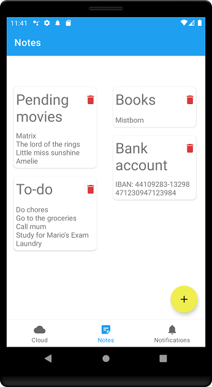

# CoolNotes
## PMDM Project

CoolNotes is a simple notes application which also include reminders via notifications. These data is automatically stored in Google cloud so the user can use the application on multiple devices simultaneously or retrieve the data in case of data loss

It have the following parts:
* Cloud screen
* Notes screen
* Notifications screen

## Notes screen

This is the main screen on which the user can consult, add, or delete notes

## Notification screen

On this screen, the user can add reminders which will be displayed on notification format at the exact time the user introduces. Also you can cancel a previously scheduled reminder

## Cloud screen

Here the user can log in in his Google account, once logged, all the notes and notifications data will be saved automatically in Google cloud, and the user can retrieve this data also on this screen
